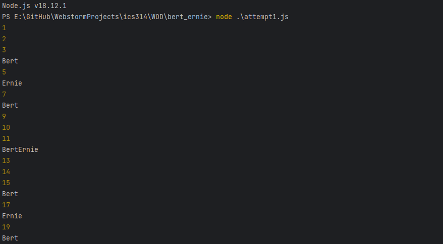

On August 30th, we were assigned our first in-class timed WOD (Workout of the Day). Professor Port roughly went over the assignment. We were to iterate through a list of numbers from 1 to 100. Any number that is divisible by 4 should return “Bert”, and every number that is divisible by 6 should return “Ernie”. If a number is divisible by both 4 and 6, then it should return “BertErnie”. Otherwise, the input itself should be returned.

## Initial Thoughts
After Professor Port went over the assignment, my initial thought was the result of a direct translation from the instructions into code. It’s the most obvious and straightforward solution, supported by the fact that a majority of the students had almost identical solutions.

### The Obvious Solution
```js
function BertErnie(num) {
    if (num % 6 === 0 && num % 4 === 0) {
        return "BertErnie";
    } else if (num % 4 === 0) {
        return "Bert";
    } else if (num % 6 === 0) {
        return "Ernie";
    } else {
        return num;
    }
}

for (let i = 1; i <= 100; i++) {
    console.log(BertErnie(i));
}
```

Although this would solve the problem, I was unsatisfied with the amount of if-else statements that were being used and I felt that there had to be a way to solve the problem without checking divisibility of the same number twice. And, obviously, there ended up being a better way.

### My Solution
```js
function BertErnie(num) {
    let str = "";
    if (num % 4 === 0) str += "Bert";
    if (num % 6 === 0) str += "Ernie";
    if (num === "") str = num;
    return str;
}

for (let i = 1; i <= 100; i++) {
    console.log(BertErnie(i));
}
```

I was able to remove the duplicated divisibility calculations and reduced the comparisons from 4 down to 3. I do believe that I can optimize the code further, by not initializing str as an empty string, then checking for null instead of an empty string, which might look something like this.

```js
function BertErnie(num) {
    let str;
    if (num % 4 === 0) str += "Bert";
    if (num % 6 === 0) str += "Ernie";
    return str ?? num; // ‘??’ is the nullish-coalescing operator.
}
```

Nonetheless, these claims of optimizations are purely theoretical and nothing has been proven by benchmarks. The obvious solution would have been sufficient and any further is likely within the realm of premature optimizations, at least within the context of this problem.

## Takeaways
I feel like the experience of completing a WOD in-class is quite valuable. It was exciting to hear about how other students implemented their solutions. It’s an extremely simple problem, yet comes with a multitude of possible solutions. I realized the importance of discussing the WOD after we’ve all had a chance to do it ourselves, since it helps open my eyes to different implementations that I hadn’t thought to use.

In the future, I want to consider using more novel approaches to solving a problem. It would be cool to figure out how I could use a dictionary to solve the BertErnie problem, or maybe even use a switch statement (both are possible). It’s a test of my knowledge about various algorithms, my familiarity with the language, and most importantly, how creative I can be with my solution.
