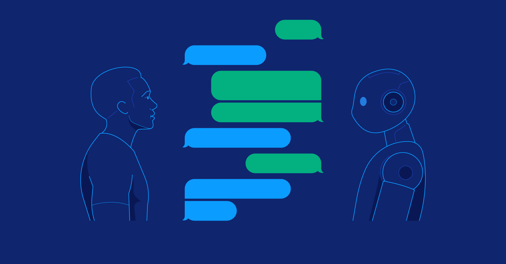

Chatbot development involves a strategic approach guided by design principles, which direct developers in creating intelligent, user-friendly, and scalable conversational interfaces. These principles serve as the underlying rules and guidelines, shaping the chatbot's form and function coherently. They are akin to sheet music for constructing structures or musical notes for a harmonious symphony. This essay will explore the intricacies of various design patterns used in chatbot development, focusing on state management, server-side rendering (SSR), and client-side rendering (CSR).

# State Management

Managing the state of the conversation is crucial for a messaging app. The State design pattern helps represent the various states a chatbot can be in during a conversation. Initially, information about the user may be collected, such as their email, name, and question. After storing that information in the state, this information is used to associate the conversations for the current session to that user. Messages, from both the user and the chatbot, are updated within the state. The state pattern aids in organizing and encapsulating the behavior associated with each state, promoting a modular and maintainable codebase.

# Server-Side Rendering (SSR)

SSR improves the rendering performance of web applications, and provides extra security for API calls, such as the authentication tokens, which would otherwise have to be made transparent to the client application, thus reducing the exposure to threats.

SSR also allows for more controlled access to the database, as the server acts as an intermediary, handling connections and executing queries. Coincidentally, this also means that SSR can improve database performance by reducing concurrent connections, minimizing contention, preventing bottlenecks, and allowing for more efficient resource utilization.

# Client-Side Rendering (CSR)

Client-Side Rendering is necessary when using components in React with State, as a client’s state does not exist on the server side. CSR is essential for dynamic updates during a chat session. This is why React is known as a reactive language rather than a functional one. It renders content on the client side, facilitating real-time updates to the page once any data within the page is changed. In chatbot development, CSR is used to dynamically render new messages and interactive elements, ensuring a responsive conversation flow.

# Wrapping it up

Design patterns play a crucial role in chatbot development, acting as a choreography that organizes the process. They are like architectural blueprints or musical notes, shaping the conversation flow. State design patterns orchestrate conversation, like a skilled conductor, while Server-Side Rendering serves as a security guard, shielding sensitive information. Client-Side Rendering acts as a responsive soloist, adapting to user cues. Using only a small selection of a developer’s toolkit in design patterns, the chatbot was already able to achieve a cohesive user experience. With the help of other design patterns, such as Publish/Subscribe or Mementos, the user experience could be enhanced further to have live updates in other parts of the website and restore chat states of closed messages.
