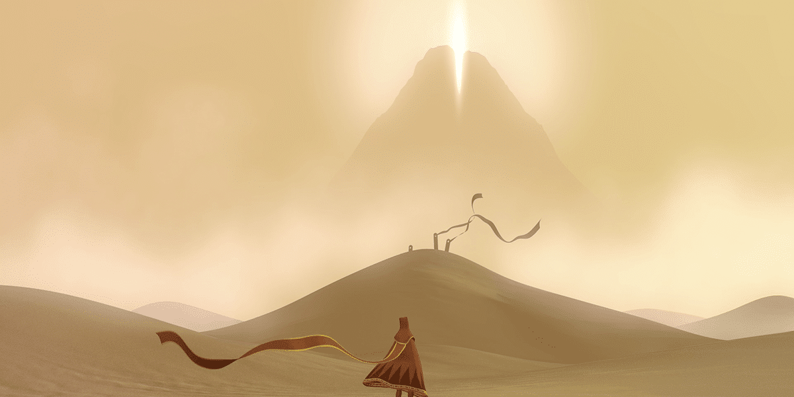

## First Experience

I started playing Minecraft in 2010, when the game was still at its early stages of development. I loved Minecraft for its ability to inspire creativity and played it every single day for many years. In 2015, my first interests in software engineering started to appear. I was 12 years old at that time, and I got an idea: “I want to create my own Minecraft server.”

I went through multiple guides on YouTube and tried my best to follow along. I was eventually able to create my first server using a free hosting provider called Aternos. It wasn’t much, but it was my first step into the world of software engineering. I eventually wanted to create more unique and custom things for my server, and found the existing plugins to be rather limiting. After searching through YouTube again for more tutorials, and working with my friend, we slowly pieced together a basic plugin that responded with `Pong!` after you typed the command `/ping`.

## Where I am now

Minecraft was what sparked my interest in software engineering. Unfortunately, I’ve since stopped playing Minecraft, and my goals in software engineering have changed. I want to diversify my skills and expand my repertoire of experience to things beyond maintaining a server, such as designing and developing websites and applications. I joined the Hawaii Annual Code Challenge in 2022 alongside my friend for this very reason.

## Hawaii Annual Code Challenge

Although I had limited experience with web development beforehand, this was the first proper experience, making use of React, TypeScript, and Firebase to build my project. It was an exciting experience and, while we faced some head-wracking challenges, we were able to complete our project on time and score the 1st place prize.

## What’s next
I plan to continue my participation in the Hawaii Annual Code Challenge in the following years to come. I also want to start diversifying my portfolio outside of just traditional programming, venturing into topics like artificial intelligence, machine learning, and computer vision. I look forward to the exciting future, and I am eager to tackle the challenges that I may run into.
