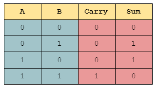

This project was completed in ICS 141, a discrete math course. This is a simple Python program that was completed that takes two integers as inputs, and returns the binary representiaton of the sum of those two numbers. The addition is performed using binary addition, so the decimal numbers are converted to binary before they are added.

This project was done individually and the work is entirely my own. I was not familiar with Python, and this experience allowed me to learn basic functions of the language, including vast variety of helper functions that are already built into the language, such as `zfill`, which pads a string with zeros, and `[::-1]`, which reverses a string. Moreover, this taught me how to transform my knowledge of how an algorithm is done in real life manually, and how to implement it in code.

## Source Code
```python
import math

def decimal_to_binary(number):
    result = ""
    while number != 0:
        remainder = number % 2
        result += str(remainder)
        number = number // 2
    # reverse the result string
    return result[::-1]

def binary_addition(x_dec, y_dec):
    x_bin = decimal_to_binary(x_dec)
    y_bin = decimal_to_binary(y_dec)

    # pad lengths to match x and y binary lengths
    if len(x_bin) != len(y_bin):
        # zfill pads left of string with zeros
        if len(x_bin) > len(y_bin):
            y_bin = y_bin.zfill(len(x_bin))
        else:
            x_bin = x_bin.zfill(len(y_bin))

    # solve the binary addition
    answer = ""
    carry = 0
    for bitIndex in reversed(range(0, len(x_bin))):
        bitsum = int(x_bin[bitIndex]) + int(y_bin[bitIndex]) + carry
        carry = bitsum // 2
        bitsum -= 2*carry
        answer += str(bitsum % 2)
    # add in last digit at the end
    answer += str(carry)

    return answer[::-1]
```