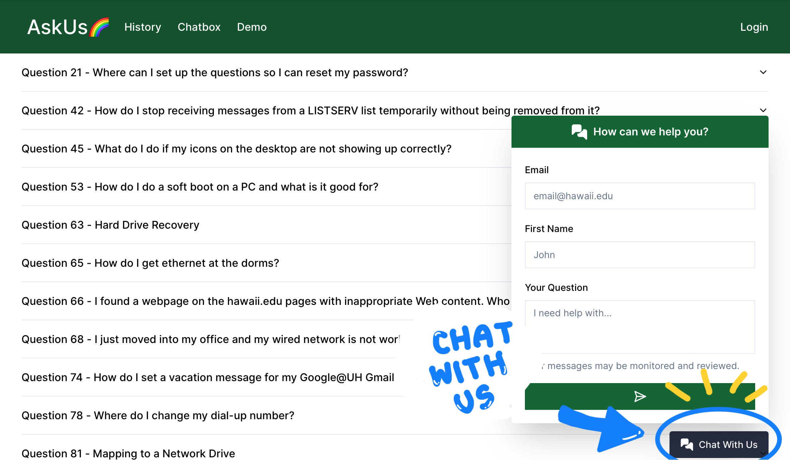
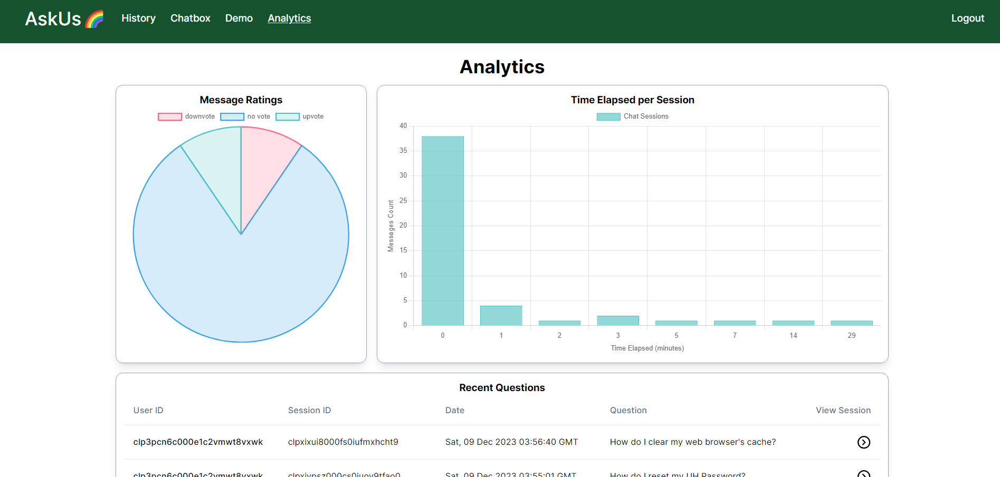

The current UH ITS Ask Us system relies on a keyword search-based approach, demanding users to input specific keywords for information retrieval, making it less user-friendly. To address this, our objective is to implement a conversational AI using LLaMA2, trained on the extensive knowledge base from the ITS team, derived from hundreds of public web pages. This initiative aims to not only alleviate workload but also enhance user experience and improve the efficiency of the help process. Simultaneously, we plan to design a reactive, intuitive, and functional user interface to ensure seamless operations.

## What I Learned

We embraced the Software Engineering class's approach to issue-driven project management (IDPM), adhering to the methodology of breaking down substantial tasks into more manageable components. Each goal was assigned to an individual team member, and we established milestones to periodically assess the overall system's status and progress. In addition, a collaborative atmosphere was fostered throughout the project's duration, with team members regularly raising issues and engaging in brainstorming sessions to provide mutual support and feedback.

Furthermore, to ensure the seamless functionality of our website, we implemented acceptance testing. This approach allowed us to systematically validate that the website operated as intended, eliminating the need for manual verification of issues after each modification. This holistic strategy not only enhanced our project management efficiency but also underscored our commitment to teamwork, proactive issue resolution, and the continuous improvement of our system, adapting to the various changes in requirements and addition of new features that we had not planned for initially.

## Challenges

Regrettably, we encountered challenges in fully adhering to the class requirements as the computational demands of running a locally hosted large language model (LLM) proved to be prohibitively expensive. Local servers with machine learning-capable GPUs, essential for this task, were not accessible on DigitalOcean. Consequently, we opted for an alternative strategy, opting to utilize Google Cloud Platform to host both our website and the large language model.

Nonetheless, our primary setbacks stemmed from opting for a locally hosted large language model instead of utilizing a platform like OpenAI, which is what many of the other groups had used. Initially, we underestimated the complexity of training the chatbot to provide accurate responses based on given information. Unfortunately, our solution exhibited issues such as hallucinating information, repeating user prompts, and unexpectedly shifting from providing responses to asking questions.

## My Contributions

Primarily, my focus centered on the website's development, encompassing tasks such as designing the interface, enhancing user experience, crafting the database structure, and implementing various features. One notable accomplishment was the analytics page, enabling administrators to dynamically assess statistics related to chatbot interactions. Additionally, I dedicated efforts to refining the large language model, experimenting with prompt optimization and exploring diverse tokenization methods, although the primary responsibility for this aspect rested with other team members.

## Links

More information about the website
- [https://bruhgroup.github.io/](https://bruhgroup.github.io/)

Our GitHub repository
- [https://github.com/bruhgroup/its-knowledge-base](https://github.com/bruhgroup/its-knowledge-base)

Try it out!
- [https://its.monkes.net/](https://its.monkes.net/)
